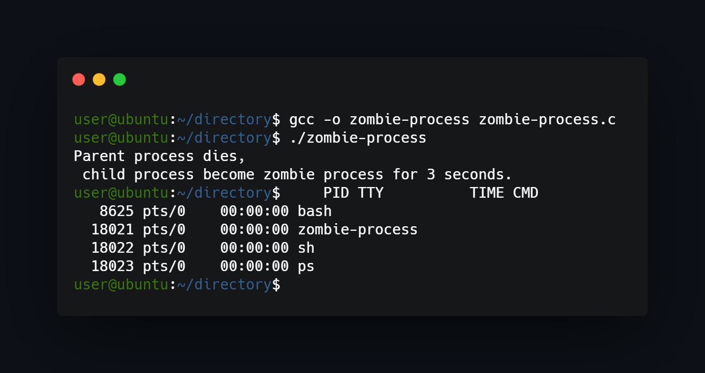

## What project do?
___
Program forks into parent-child subprocesses and then parent dies and child becomes zombie for 3 seconds.



## How to use?
___
Just compile and run:
```
gcc -o zombie-process zombie-process.c 
./zombie-process 
```
<!--https://banner.godori.dev/ height:150-->
<!--https://shields.io/-->
<!--https://carbon.now.sh/-->